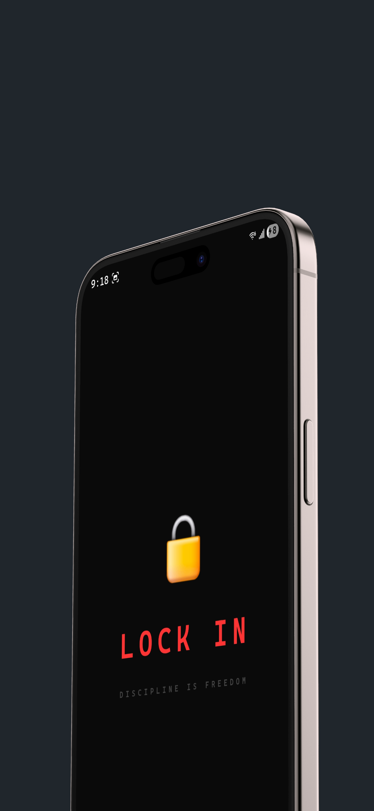
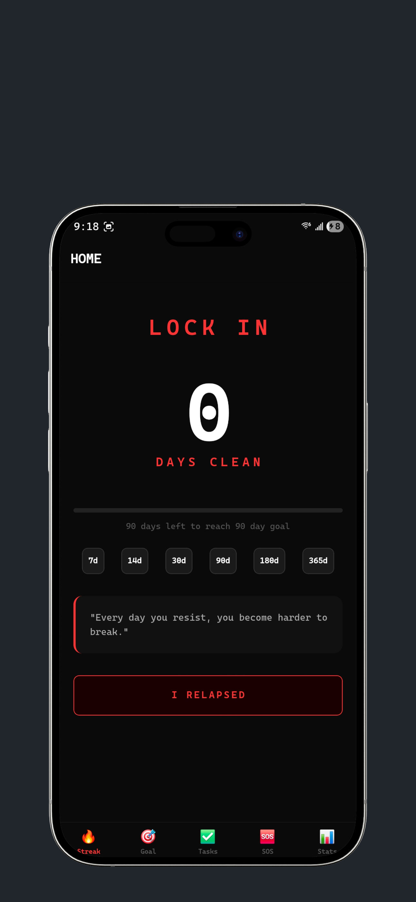
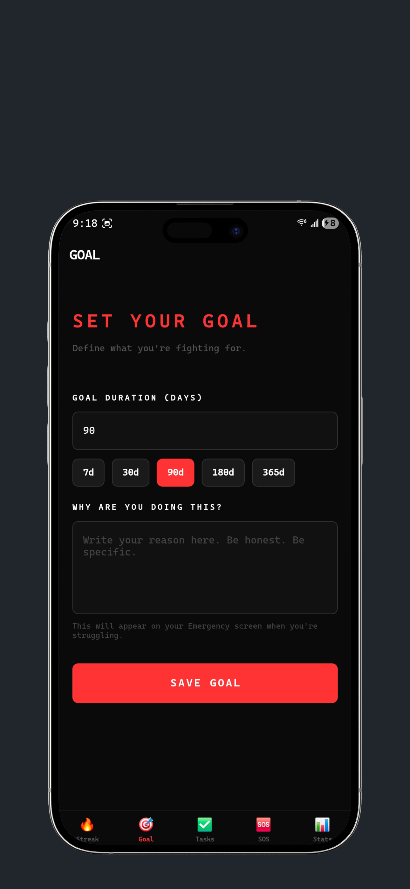
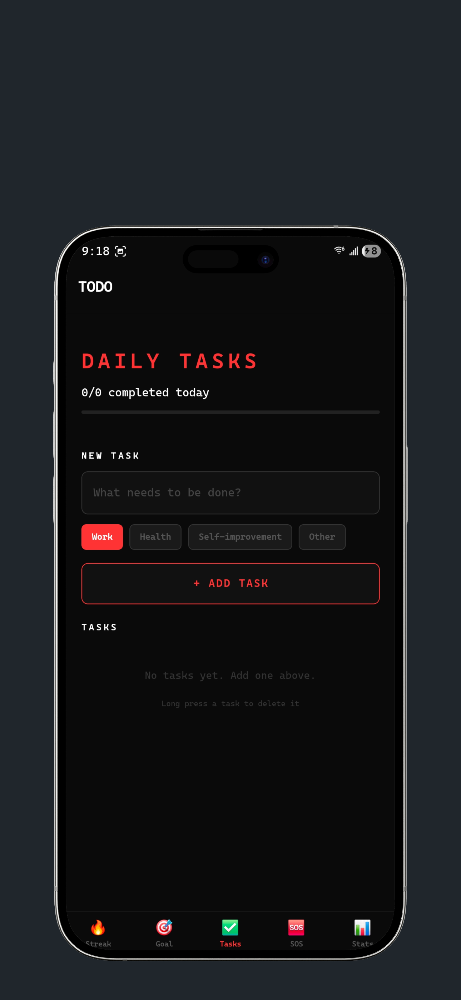
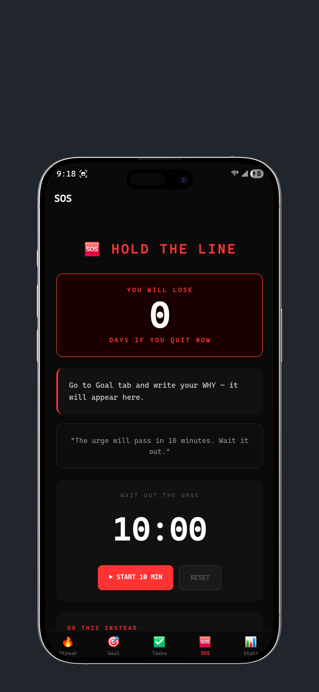
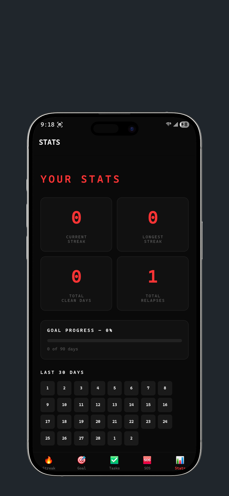

# 🔒 Lock In

A discipline and accountability app for men who want to quit compulsive habits, build streaks, and stay focused on what matters.

---

## 📱 Screenshots

| App | Home | Goal |
|-----|------|------|
|  |  |  |

| Tasks | SOS | Stats |
|-------|-----|-------|
|  |  |  |
```
---

✨ Features

🔥 Streak Counter — tracks days clean with milestone badges (7, 14, 30, 90, 180, 365 days)
🎯 Goal Setting — set a target duration and write your personal "why"
✅ Daily Tasks — to-do list with categories: Work, Health, Self-improvement, Other
🆘 SOS Emergency Screen — urge timer, streak loss warning, and action prompts
📊 Stats Dashboard — 30-day calendar, longest streak, total clean days
🔔 Daily Notifications — 7AM push notification with streak count and days remaining
🖤 Custom Dark Theme — masculine, minimal, red and black design
⚡ Splash Screen — animated intro screen on launch
😂 Faahhh Sound — plays on relapse confirmation

---

🛠 Tech Stack

React Native 0.84
TypeScript
React Navigation
AsyncStorage
Notifee
react-native-sound

---

🚀 Getting Started

Prerequisites
Node.js 18+
Android Studio
Xcode
JDK 17

Installation

Clone the repo
git clone https://github.com/deep1262/LockInApp.git

Navigate into project
cd LockInApp

Install dependencies
npm install

iOS only
cd ios && pod install && cd ..
```

### Run on Android
```bash
npx react-native run-android
```

### Run on iOS
```bash
npx react-native run-ios --device
```

### Build Release APK
```bash
cd android && ./gradlew assembleRelease
```
APK will be at: `android/app/build/outputs/apk/release/app-release.apk`

---

## 📁 Project Structure
```
LockInApp/
├── src/
│   ├── screens/
│   │   ├── HomeScreen.tsx       # Streak counter + dashboard
│   │   ├── GoalScreen.tsx       # Goal setting + why statement
│   │   ├── TodoScreen.tsx       # Daily task list
│   │   ├── EmergencyScreen.tsx  # SOS urge screen
│   │   └── StatsScreen.tsx      # Stats + 30 day calendar
│   ├── components/
│   │   └── SplashScreen.tsx     # Animated splash screen
│   └── utils/
│       └── notifications.ts     # Daily notification setup
├── android/                     # Native Android code
├── ios/                         # Native iOS code
├── App.tsx                      # Root component + navigation
└── package.json
```

---

## 📄 License

Private project — all rights reserved.

---

Built by Deep Chowdary
